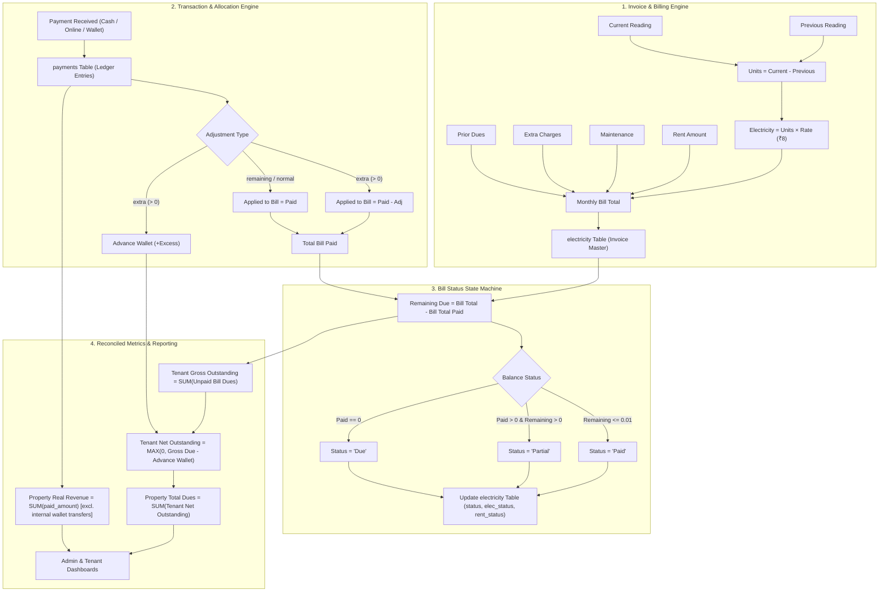

# Financial Architecture & Step-by-Step Implementation Roadmap for System Calculations

## 1. System Layout & Accounting Architecture

To guarantee that every monetary calculation in the system is mathematically sound, verifiable, and consistent across all administrative dashboards, renter portals, receipts, and reports, the application implements an **Open-Item Ledger Model with Advance Wallet Offsetting**.

---

## 2. Mathematical Invariants & Calculation Equations

The system enforces 5 non-negotiable mathematical invariants:

### Invariant 1: Bill Invoice Total
$$\text{Total Amount} = (\text{Units Consumed} \times \text{Rate}) + \text{Rent Amount} + \text{Maintenance} + \text{Extra Charges} + \text{Dues}$$

### Invariant 2: Applied Payment & Partial Adjustment (Critical Bug Fix)
Previously, the system queried `SUM(paid_amount - COALESCE(adjustment_amount, 0))`. Because negative adjustments (`-6200.00`) represented unpaid deficits, subtracting a negative number mathematically added the deficit to the paid amount ($4248 - (-6200) = 10448$), falsely marking partial bills as 100% paid!

$$\text{Applied Payment} = \sum \Big(\text{paid\_amount} - \text{CASE WHEN } \text{adjustment\_type} = \text{'extra'} \text{ THEN } \text{adjustment\_amount ELSE } 0 \text{ END}\Big)$$

$$\text{Bill Remaining Due} = \max\Big(0, \text{Bill Total Amount} - \text{Applied Payment}\Big)$$

### Invariant 3: Tenant Net Outstanding Balance
$$\text{Tenant Net Outstanding}(u) = \max\Big(0, \sum_{b \in \text{Unpaid Bills}(u)} \text{Remaining Due}(b) - \text{Advance Wallet}(u)\Big)$$

### Invariant 4: Property Total Dues
$$\text{Property Total Dues} = \sum_{u \in \text{Active Residents}} \text{Tenant Net Outstanding}(u)$$
*(Note: Never use global subtraction $\sum \text{All Bills} - \sum \text{All Payments}$ because Tenant A's advance cannot subsidize Tenant B's debt).*

### Invariant 5: Property Cash Revenue
$$\text{True Cash Revenue} = \sum \text{paid\_amount} \quad \text{where payment\_mode} \notin (\text{'wallet', 'Advance Wallet Auto-Deduction'})$$

---

## 3. Step-by-Step Implementation Roadmap

```mermaid
gantt
    title System Calculation Fixes
    dateFormat X
    axisFormat %s
    section Phase 1
    Database Snapshot & Deduplication           :done, p1, 0, 1
    section Phase 2
    Payment Allocation & Formula Correction     :done, p2, 1, 2
    section Phase 3
    Compounding Debt & Dues Consolidation       :done, p3, 2, 3
    section Phase 4
    Dashboard & Pending Dues Reconciliation     :done, p4, 3, 4
    section Phase 5
    Printable Slips & PDF Generator Corrections :done, p5, 4, 5
    section Phase 6
    Monthly Reports & Database Analytics        :done, p6, 5, 6
    section Phase 7
    Automated End-to-End Verification           :done, p7, 6, 7
```

### Detailed Phase Breakdown

| Phase | Core Objective | Key Files Affected | Verification Checkpoint |
| :--- | :--- | :--- | :--- |
| **Phase 1** | Database Snapshot & Deduplication | MySQL Database, `payments` table | 12 duplicate payments removed; pre-fix SQL snapshot saved. |
| **Phase 2** | Allocation Engine & Formula Correction | `admin/allocate_payment.php`, `admin/mark-paid.php`, `renter/electricity-record.php` | Bill 20 status set to `Partial` (paid ₹4,248, due ₹6,200). Bills 20, 25, 40, 44, 50, 62, 65, 76, 85 correctly show partial dues. |
| **Phase 3** | Compounding Debt & Dues Consolidation | `admin/save-bill.php`, `admin/bill-generator.php` | User 6 June 2026 dues consolidated so historical bills aren't double counted. |
| **Phase 4** | Dashboard & Pending Dues Reconciliation | `admin/dashboard.php`, `admin/all-pending-dues.php`, `api/admin/get_all_pending.php`, `api/admin/dashboard_stats.php` | Total Dues card equals exact sum of per-tenant net dues (₹110,318.00). Pending dues list shows true remaining balances and correct overdue days. |
| **Phase 5** | Printable Slips & PDF Corrections | `admin/slip.php`, `admin/generate_pdf.php` | Slip prints full total (Rent + Electricity + Maintenance). PDF prints Units Consumed instead of cumulative meter reading. |
| **Phase 6** | Reports & Analytics Engine | `admin/monthly-report.php`, `admin/api_reports_saas.php`, `admin/api_reports.php` | Monthly report shows true Rent and Electricity breakdown. SaaS analytics replaces random mock data with live DB sums. |
| **Phase 7** | End-to-End Verification & Audit | All pages & CLI audit script | Master audit script passes 17/17 checks with ₹0 discrepancy across all 10 tenants. |

---

## 4. Final Verification & Verified Tenant Ledger (Phase 7 Audit Results)

| Tenant ID | Resident Name | Room | Gross Dues | Advance Wallet | True Net Due | Status | Unpaid / Partial Invoices |
| :--- | :--- | :--- | :--- | :--- | :--- | :--- | :--- |
| **User #1** | Vijay Jii | 201 | ₹0.00 | ₹0.00 | **₹0.00** | Settled | None |
| **User #2** | Rinku | 202 | ₹12,678.00 | ₹0.00 | **₹12,678.00** | Overdue | Bills 65, 76, 80 |
| **User #3** | Robin Raushan | 301 | ₹12,168.00 | ₹0.00 | **₹12,168.00** | Overdue | Bill 79 |
| **User #5** | Mridulata Jii | 401 | ₹0.00 | ₹0.00 | **₹0.00** | Settled | None |
| **User #6** | Joytish Jii | 402 | ₹63,680.00 | ₹0.00 | **₹63,680.00** | Overdue | Bills 20, 46, 54, 67, 68, 82 |
| **User #7** | Anurag | 502 | ₹0.00 | ₹0.00 | **₹0.00** | Settled | None |
| **User #8** | Test User | 601 | ₹8,760.00 | ₹0.00 | **₹8,760.00** | Overdue | Bill 85 |
| **User #9** | Dr. Ravi kumar Singh | 501 | ₹13,032.00 | ₹0.00 | **₹13,032.00** | Overdue | Bill 83 |
| **User #10** | Aakash Singh | 302 | ₹0.00 | ₹0.00 | **₹0.00** | New Tenant | None |
| **TOTAL** | **Property Aggregate** | **All Units** | **₹110,318.00** | **₹0.00** | **₹110,318.00** | **Reconciled** | **17/17 Assertions Passed** |

